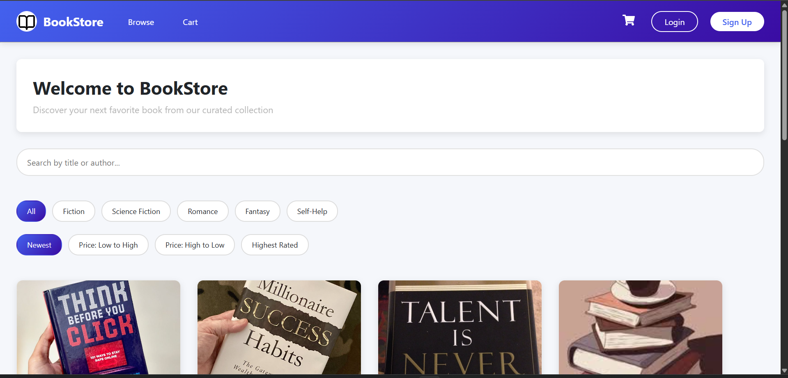
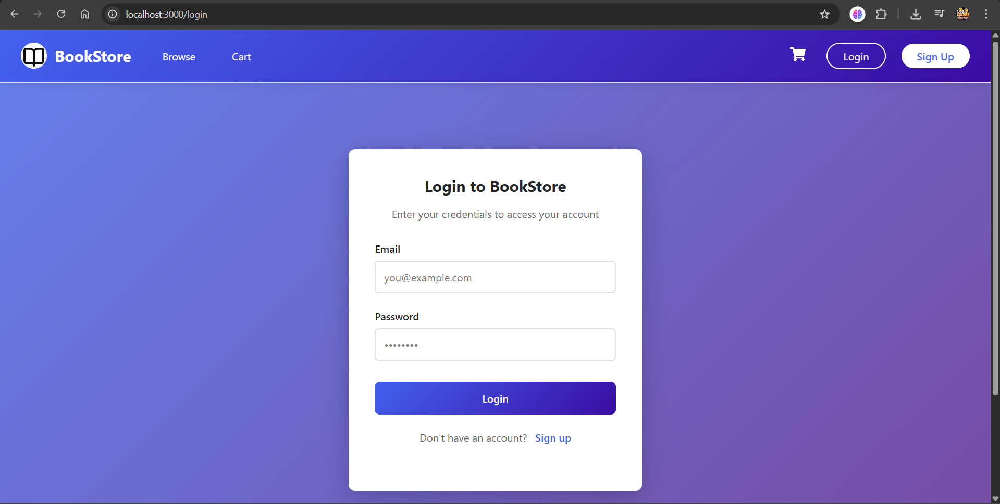
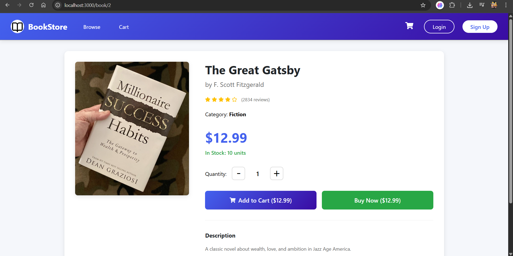
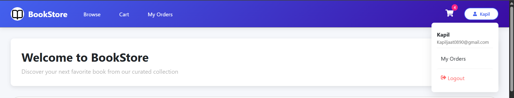
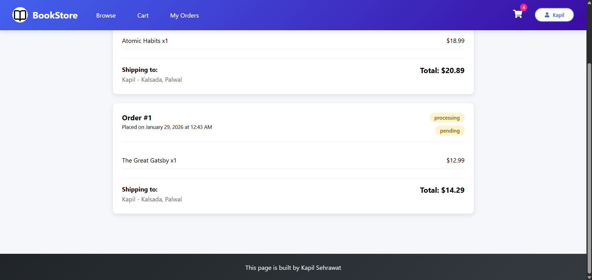
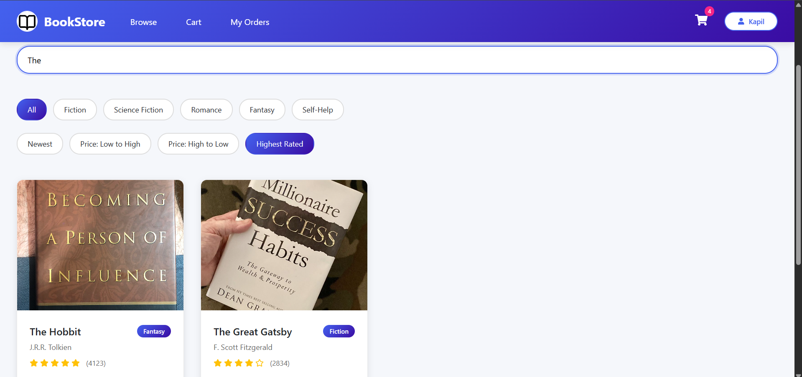
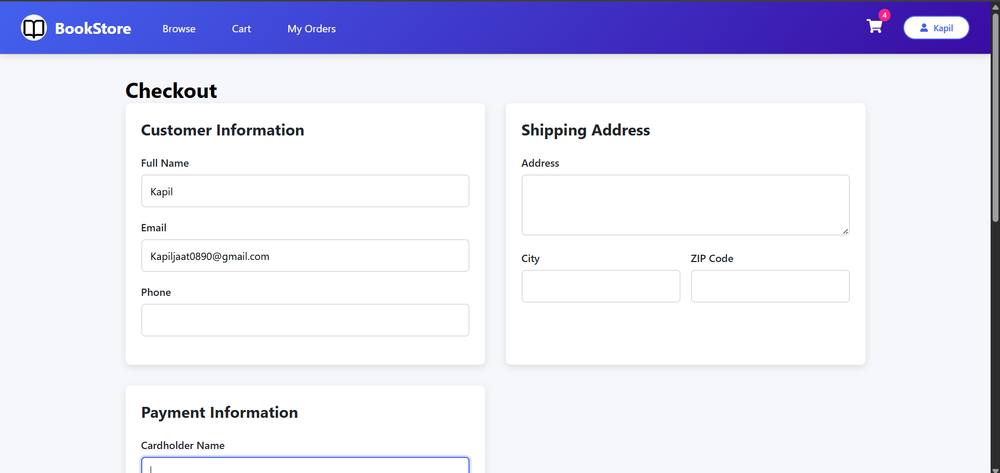

# 📚 BookStore – Full-Stack E-Commerce Application


A full-stack online bookstore built using **React**, **Node.js**, **Express**, and **MySQL**.  
The application provides a complete e-commerce experience including authentication, book browsing, shopping cart, checkout, and order management.
---

## 📖 Overview

**BookStore** is a modern full-stack e-commerce web application designed for online book purchases.  
It supports user authentication, category-based browsing, cart persistence, secure checkout, and order history tracking.

---

## ✨ Features

### 🔐 Authentication & Authorization
- User registration and login using JWT
- Protected routes for authenticated users
- Password hashing with bcrypt
- Persistent login sessions

### 📚 Book Browsing
- Browse books by category
- Search by title or author
- Sort by price, rating, or newest
- Detailed book pages with descriptions

### 🛒 Shopping Cart
- Add and remove books
- Update item quantities
- Automatic price calculations
- Cart persistence across sessions

### 💳 Checkout & Orders
- Secure checkout flow
- Shipping address management
- Order history tracking
- Order status updates

### 👤 User Profile
- View and update profile information
- Change password
- View past orders

---

## 🖼 Screenshots

### Application Preview









---

## 🛠 Tech Stack

### Frontend
- React 18 (Functional Components & Hooks)
- React Router v6
- Axios
- Context API
- Custom CSS

### Backend
- Node.js
- Express.js
- JWT Authentication
- bcryptjs
- CORS

### Database
- MySQL 8.0
- Relational schema with normalized tables

---

## ⚙️ Installation & Setup

### Prerequisites
- Node.js v18+
- MySQL v8.0+
- npm or yarn

### Clone Repository
```bash
git clone https://github.com/KapilSehrawat2005/Book-Store.git
cd Book-Store
```

Backend Setup
```bash
cd server
npm install
```

Create a .env file inside the server folder:
```.env
JWT_SECRET=your_jwt_secret_key
PORT=5000
DB_HOST=localhost
DB_USER=root
DB_PASSWORD=your_mysql_password
DB_NAME=BookStore
```
Frontend Setup
```bash
cd ../client
npm install
```


Run the Application
Start Backend
```bash
cd server
npm start
```
Start Frontend
```bash
cd client
npm start
```

Backend: http://localhost:5000

Frontend: http://localhost:3000

# 🔌 API Endpoints
 ### Authentication

POST /api/register

POST /api/login

### Books

GET /api/books

GET /api/books/:id

Cart (Protected)

GET /api/cart

POST /api/cart

PUT /api/cart/:id

DELETE /api/cart/:id

Orders (Protected)

GET /api/orders

POST /api/orders

User (Protected)

GET /api/users/profile

PUT /api/users/password

### 🔒 Security

JWT-based authentication with expiration

Password hashing using bcrypt

Protected API routes

Parameterized SQL queries

CORS configuration

### 📱 Responsive Design

The application supports:

Desktop devices

Tablets

Mobile screens

Layout adapts using responsive CSS techniques.

# 🚀 Deployment
### Backend

Set up MySQL on hosting provider

Configure environment variables

Deploy using AWS, DigitalOcean, or Heroku

### Frontend
npm run build


### 📄 License

This project is licensed under the MIT License.

### 📬 Contact

Kapil Sehrawat
8397853961
GitHub: https://github.com/KapilSehrawat2005
